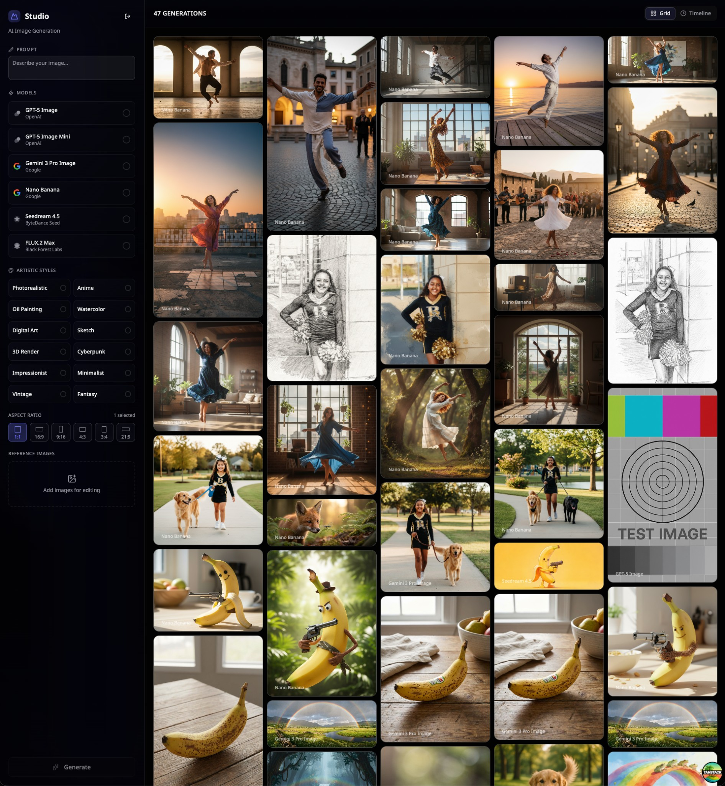

# AI Image Generation Studio

A modern, full-stack web application for generating AI images using multiple models through OpenRouter. Built with TanStack Start, React, TypeScript, and shadcn/ui.



## Features

- 🎨 **Multiple AI Models**: Generate images using various models from OpenAI, Google, ByteDance Seed, and Black Forest Labs (FLUX)
- 🖼️ **Multiple Aspect Ratios**: Generate images in different aspect ratios simultaneously (1:1, 16:9, 9:16, 4:3, 3:4)
- 🎭 **Artistic Styles**: Apply preset artistic styles including photorealistic, anime, oil painting, watercolor, digital art, sketch, 3D render, cyberpunk, impressionist, minimalist, vintage, and fantasy
- 📸 **Reference Images**: Upload reference images to guide the generation process
- 🖼️ **Gallery View**: Browse your generated images in a beautiful masonry grid layout or timeline view
- 👤 **User Authentication**: Secure authentication with email/password using Better Auth
- ☁️ **Cloud Storage**: Images are stored in Cloudflare R2 with presigned URLs
- 📱 **Mobile Responsive**: Fully optimized for mobile devices with touch-friendly UI

## Tech Stack

- **Framework**: [TanStack Start](https://tanstack.com/start) (React SSR)
- **UI Components**: [shadcn/ui](https://ui.shadcn.com/)
- **Styling**: Tailwind CSS v4
- **Database**: Prisma with SQLite
- **Authentication**: Better Auth
- **Image Storage**: Cloudflare R2 (S3-compatible)
- **Image Generation**: OpenRouter API
- **Layout**: Masonic (masonry grid)

## Prerequisites

- Node.js 18+ (or Bun)
- npm, yarn, pnpm, or bun
- Cloudflare R2 account (for image storage)
- OpenRouter API key (for image generation)

## Getting Started

### 1. Clone the repository

```bash
git clone <repository-url>
cd imagegen
```

### 2. Install dependencies

```bash
npm install
# or
bun install
```

### 3. Set up environment variables

Create a `.env` file in the root directory:

```env
# Database
DATABASE_URL="file:./dev.db"

# OpenRouter API (required for image generation)
OPENROUTER_API_KEY="your-openrouter-api-key"

# Cloudflare R2 (required for image storage)
R2_ACCOUNT_ID="your-r2-account-id"
R2_ACCESS_KEY_ID="your-r2-access-key-id"
R2_SECRET_ACCESS_KEY="your-r2-secret-access-key"

# Better Auth (optional, defaults to http://localhost:3000)
BETTER_AUTH_URL="http://localhost:3000"
BETTER_AUTH_SECRET="your-secret-key-here"
```

### 4. Set up the database

```bash
# Generate Prisma client
npm run prisma:generate

# Run migrations
npm run prisma:migrate
```

### 5. Start the development server

```bash
npm run dev
```

The application will be available at `http://localhost:3000`.

### 6. Create an account

1. Navigate to the signup page
2. Create an account with your email and password
3. Start generating images!

## Usage

### Generating Images

1. **Enter a prompt**: Describe the image you want to generate
2. **Select models**: Choose one or more AI models to use
3. **Choose aspect ratios**: Select one or more aspect ratios (you'll get one image per ratio)
4. **Add artistic styles** (optional): Select preset styles to enhance your prompt
5. **Upload reference images** (optional): Add reference images to guide the generation
6. **Click "Generate"**: Your images will be generated and appear in the gallery

### Viewing Images

- **Grid View**: Browse all images in a masonry layout
- **Timeline View**: See images organized by generation date

### Mobile Experience

On mobile devices:

- Use the sticky "Create Generation" button at the bottom
- Access the generation form via a bottom drawer
- Swipe through images in the gallery

## Available Scripts

- `npm run dev` - Start development server
- `npm run build` - Build for production
- `npm run preview` - Preview production build
- `npm run lint` - Run ESLint
- `npm run format` - Format code with Prettier
- `npm run check` - Format and fix linting issues
- `npm run prisma:generate` - Generate Prisma client
- `npm run prisma:migrate` - Run database migrations
- `npm run prisma:studio` - Open Prisma Studio (database GUI)

## Project Structure

```
src/
├── components/
│   ├── studio/          # Image generation studio components
│   └── ui/              # shadcn/ui components
├── lib/                 # Utilities and configurations
│   ├── auth.ts         # Better Auth configuration
│   ├── auth-client.ts  # Client-side auth
│   ├── db.ts           # Prisma client
│   ├── openrouter.ts   # OpenRouter API integration
│   └── r2.ts           # Cloudflare R2 integration
├── routes/             # TanStack Router routes
│   ├── index.tsx       # Main studio page
│   ├── login.tsx       # Login page
│   └── signup.tsx      # Signup page
└── server-functions/   # Server-side functions
    └── image-studio.ts # Image generation logic
```

## Environment Variables Reference

| Variable               | Description                             | Required |
| ---------------------- | --------------------------------------- | -------- |
| `DATABASE_URL`         | SQLite database connection string       | Yes      |
| `OPENROUTER_API_KEY`   | API key for OpenRouter image generation | Yes      |
| `R2_ACCOUNT_ID`        | Cloudflare R2 account ID                | Yes      |
| `R2_ACCESS_KEY_ID`     | Cloudflare R2 access key ID             | Yes      |
| `R2_SECRET_ACCESS_KEY` | Cloudflare R2 secret access key         | Yes      |
| `BETTER_AUTH_URL`      | Base URL for authentication callbacks   | No       |
| `BETTER_AUTH_SECRET`   | Secret key for Better Auth              | No       |

## Contributing

1. Fork the repository
2. Create a feature branch (`git checkout -b feature/amazing-feature`)
3. Commit your changes (`git commit -m 'Add some amazing feature'`)
4. Push to the branch (`git push origin feature/amazing-feature`)
5. Open a Pull Request

## License

This project is private and proprietary.
